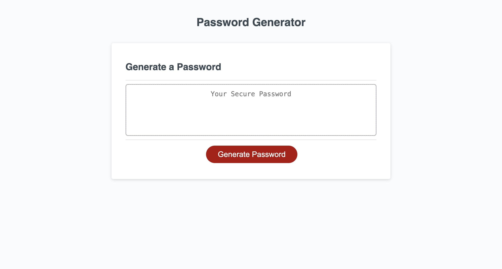

# Password Generator App 
## Pass Lock Forge

## Description

Pass Lock Forge is a password generator app aimed at providing users with strong and unique passwords to enhance their online security. The app will offer a user-friendly interface and robust functionality to generate passwords according to the users' preferences and security requirements.

Link to the deployed application: https://m-maha21.github.io/pass-lock-forge/

## Screenshot 
The following image shows the web application's appearance and functionality:

    
## Table of Contents 

- [Description](#description)
- [Screenshot](#screenshot)
- [Installation](#installation)
- [Usage](#usage)
- [License](#license)
- [Contribution](#contribution)
- [Credits](#credits)
- [Tools](#tools)

## Installation

To install my password generator app from my GitHub repository, you need to follow these steps:
1. Clone the repository: you can do this by using the git clone command followed by the URL of the repository.
2. Navigate to the Repository Directory: use the cd command to navigate into the directory of the cloned repository
3. Run the Scheduler: once you've cloned the repository and configured the project (if necessary), you should be able to run the pass lock forge application.
4. Test: after installation, it's a good practice to test the scheduler to ensure it's working as expected. Create some test schedules or tasks to verify its functionality.

## Usage

Please follow the steps below to generate a password:
1. Click on the button: Generate Password
2. Answer the prompts to meet the password criteria:
- Length of password: at least 8 characters but no more than 128.
- Character types: 
Lowercase
Uppercase
Numeric
Special characters ($@%&*, etc)
3. Select at least one character type 
4. Once the prompts have been asnwered, the password will be generated and displayed into the box 

## License
N/A

## Contribution

N/A

## Credits

Name: Mahamuda
GitHub: m-maha21

## Tools

The tools that I have used in project are: Advanced JavaScript, CSS, HTML

